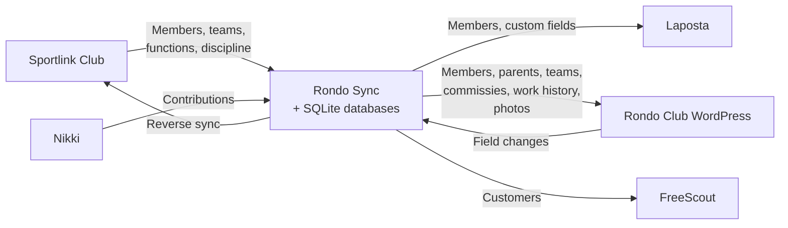

# Rondo Sync

[](https://nodejs.org/)
[](#license)
[](https://github.com/RondoHQ/rondo-sync/releases)

**Automated member data synchronization for Dutch sports clubs.** Extracts data from Sportlink Club (KNVB's member administration — no API) via headless browser automation and syncs it to Laposta, Rondo Club (WordPress), and FreeScout. Club volunteers never enter the same data twice.

## System Architecture



## How It Works

- **Browser automation** — Playwright (headless Chromium) with TOTP 2FA navigates Sportlink's UI to extract data from a system that has no API
- **Hash-based change detection** — SHA-256 diffing ensures only records that actually changed get synced, minimizing API calls and avoiding unnecessary updates
- **State tracking** — 4 SQLite databases maintain ID mappings, sync history, and photo upload state across systems
- **Pipeline locking** — flock-based concurrency prevention ensures parallel cron jobs don't collide
- **Email reports** — HTML summaries via Lettermint after every sync run
- **Photo sync** — Downloads member photos from Sportlink, uploads to WordPress with a state machine tracking each photo's lifecycle
- **Reverse sync** — Pushes Rondo Club field changes back to Sportlink via browser automation

## Sync Pipelines

| Pipeline | Schedule | What it syncs |
|----------|----------|---------------|
| People | 4x daily | Members, parents, photos → Laposta + Rondo Club |
| Functions | 4x daily + weekly full | Commissies, free fields, work history → Rondo Club |
| Nikki | Daily | Financial contributions → Rondo Club |
| FreeScout | Daily | Members → FreeScout helpdesk customers |
| Teams | Weekly | Team rosters + work history → Rondo Club |
| Discipline | Weekly | Discipline cases → Rondo Club |

### Daily Timeline

All times in Europe/Amsterdam timezone.

```
 07:00         Nikki sync
 07:30         Functions sync (recent) → 08:00 People sync (1st) + FreeScout sync
 10:30         Functions sync (recent) → 11:00 People sync (2nd)
 13:30         Functions sync (recent) → 14:00 People sync (3rd)
 16:30         Functions sync (recent) → 17:00 People sync (4th)

 Sunday  01:00  Functions sync (full --all)
 Sunday  06:00  Teams sync
 Monday  23:30  Discipline sync
```

## Quick Start

**Prerequisites:** Node.js 18+, a Sportlink Club account with TOTP 2FA configured.

```bash
npm install
npx playwright install chromium
cp .env.example .env  # Fill in your credentials
```

Run a pipeline:

```bash
scripts/sync.sh people           # Members, parents, photos
scripts/sync.sh functions        # Commissies + free fields (recent)
scripts/sync.sh functions --all  # Full commissie sync (all members)
scripts/sync.sh nikki            # Nikki contributions
scripts/sync.sh freescout        # FreeScout customers
scripts/sync.sh teams            # Team rosters
scripts/sync.sh discipline       # Discipline cases
scripts/sync.sh all              # Everything
```

See the [Installation Guide](docs/installation.md) for full setup instructions including server deployment and cron configuration.

## Documentation

| Document | Contents |
|----------|----------|
| [Installation](docs/installation.md) | Prerequisites, server setup, initial sync, cron |
| [Architecture](docs/sync-architecture.md) | System overview, schedules, field mappings, data flow |
| [People Pipeline](docs/pipeline-people.md) | 7-step flow, Laposta + Rondo Club field mappings |
| [Nikki Pipeline](docs/pipeline-nikki.md) | Contribution download + Rondo Club sync |
| [Teams Pipeline](docs/pipeline-teams.md) | Team download + work history |
| [Functions Pipeline](docs/pipeline-functions.md) | Commissies, free fields, daily vs full mode |
| [FreeScout Pipeline](docs/pipeline-freescout.md) | Customer sync with custom fields |
| [Discipline Pipeline](docs/pipeline-discipline.md) | Discipline cases + season taxonomy |
| [Reverse Sync](docs/reverse-sync.md) | Rondo Club → Sportlink browser automation |
| [Database Schema](docs/database-schema.md) | All 4 databases, 21 tables |
| [Operations](docs/operations.md) | Server ops, monitoring, deploys |
| [Troubleshooting](docs/troubleshooting.md) | Common issues and solutions |
| [Utility Scripts](docs/utility-scripts.md) | Cleanup, validation, inspection tools |

## Tech Stack

Node.js 18+ · Playwright · better-sqlite3 · otplib · Lettermint · dotenv

## License

Private project — all rights reserved.
